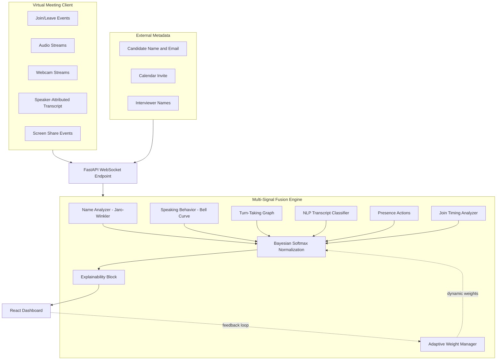

# Sherlock Real-Time Candidate Identification System (SCI)

Sherlock is an AI platform designed to detect interview fraud in real time over virtual meeting systems (Google Meet, Microsoft Teams, Zoom). This repository contains a working prototype of the **Sherlock Candidate Identification System (SCI)**. 

SCI automatically identifies the candidate in a live virtual meeting, updates identification confidence dynamically as events occur, handles typos and generic device names, and explains why a participant was selected using a **Multi-Signal Bayesian Evidence Fusion Engine**.

---

## 🚀 How to Run the Prototype

The system is split into a **Python FastAPI Backend** (which runs the fusion logic) and a **React + TypeScript Frontend** (which simulates the meeting and displays the dashboard).

### Prerequisites
* **Python**: 3.10 or higher
* **Node.js**: v18 or higher & `npm`

---

### Step 1: Run the Python Backend
1. Open a terminal and navigate to the `backend/` folder:
   ```bash
   cd backend
   ```
2. Create and activate a Python virtual environment:
   ```bash
   # On Windows (PowerShell):
   python -m venv venv
   .\venv\Scripts\activate

   # On macOS/Linux:
   python3 -m venv venv
   source venv/bin/activate
   ```
3. Install dependencies:
   ```bash
   pip install -r requirements.txt
   ```
4. Start the FastAPI server:
   ```bash
   python main.py
   ```
   *The backend will start on [http://localhost:8000](http://localhost:8000) and establish a WebSocket listener on `/ws`.*

---

### Step 2: Run the React Frontend
1. Open a new terminal window and navigate to the `frontend/` folder:
   ```bash
   cd frontend
   ```
2. Install Node modules:
   ```bash
   npm install
   ```
3. Start the Vite development server:
   ```bash
   npm run dev
   ```
4. Open your browser and navigate to the link printed in the terminal (usually [http://localhost:5173](http://localhost:5173)).

---

## 🛠️ System Architecture

SCI is built using **event-driven streaming**. Instead of polling, it processes meeting events (joins, speech activity, webcam changes, screensharing, live transcript lines) in real time over a WebSocket connection.

```
       +-----------------------------------------------------------------+
       |                       VIRTUAL MEETING CLIENT                    |
       |       (Ingests Speech Activity, Webcams, Transcripts, etc.)      |
       +-------------------------------+---------------------------------+
                                       | (Real-time Stream)
                                       v
                             +-------------------+
                             |  FastAPI WebSocket|
                             +---------+---------+
                                       |
                                       v
                         +---------------------------+
                         |    Fusion Ingestion API   |
                         +-------------+-------------+
                                       |
    +----------------------------------+------------------------------------+
    |                          FUSION ENGINE LAYER                          |
    |                                                                       |
    |  +--------------------+  +----------------------+  +---------------+  |
    |  | Name Similarity    |  | Acoustic Analyzer    |  | Turn-Taking   |  |
    |  | (Jaro-Winkler/J-W) |  | (Speaking Durations) |  | Graph Tracker |  |
    |  +---------+----------+  +----------+-----------+  +-------+-------+  |
    |            |                        |                      |          |
    |            +------------------+     |     +----------------+          |
    |                               |     |     |                           |
    |                               v     v     v                           |
    |                         +-----------------------+                     |
    |                         |  Weighted Evidence    |                     |
    |                         |  Accumulator Matrix   |                     |
    |                         +-----------+-----------+                     |
    |                                     |                                 |
    |                                     v                                 |
    |                         +-----------------------+                     |
    |                         |    Bayesian Belief    |                     |
    |                         |    Softmax Scaling    |                     |
    |                         +-----------+-----------+                     |
    |                                     |                                 |
    +-------------------------------------|---------------------------------+
                                          v
                              +-----------------------+
                              | Explainability Block  |
                              |  (LIME-like Weight    |
                              |   Signal Attribution) |
                              +-----------+-----------+
                                          |
                                          v (Update JSON Broadcast)
                              +-----------------------+
                              |   React UI Simulator  |
                              +-----------------------+

### Core Algorithms and Weak Signals

1. **Identity & Name Matcher (Jaro-Winkler Similarity)** *(Weight: 30%)*:
   Matches the display name against expected metadata. Checks for typos, handles email prefixes, and blocks known interviewers (negative weight). It also filters generic devices (e.g., "MacBook Pro") to prevent false name match outputs.
2. **Behavioral Speech Ratio Classifier** *(Weight: 18%)*:
   Calculates the candidate's talking duration ratio over the call. Peak candidate likelihood is mapped to a bell-shaped curve around $45\%$. A silent participant or a monologuer is penalized.
3. **Turn-Taking Interaction Graph** *(Weight: 18%)*:
   Tracks turn dynamics (Speaker A $\rightarrow$ Speaker B). In standard interviews, the candidate has high interaction density with verified interviewers.
4. **Semantic Keyphrase Classifier (NLP)** *(Weight: 14%)*:
   Scans the transcript stream for semantic candidate indicators (e.g., *"in my resume"*, *"my experience"*) vs interviewer indicators (e.g., *"tell me about"*, *"walk us through"*).
5. **Presence Actions** *(Weight: 10%)*:
   Webcam status (+20% active, -10% inactive) and Screen Sharing (+100% active).
6. **Join Timing Analyzer** *(Weight: 10%)*:
   Analyzes when participants join relative to the meeting start. Candidates typically join among the first 2-3 participants. Late joiners (>60s after meeting start) are penalized as likely observers.

### Continuous Learning (Adaptive Weight Manager)

The system includes an `AdaptiveWeightManager` that adjusts signal weights based on historical identification accuracy:

- After each session, calling `confirm_identification(was_correct=True/False)` updates weights
- Signals that contributed to correct identifications get boosted
- Signals that contributed to incorrect identifications get penalized
- Weights are re-normalized after each update and have a minimum floor of 5%
- Learning rate is 2% per session to prevent oscillation

This enables the system to **improve over time** as it processes more interviews.

---

## 📐 Architecture Diagram



---

## 📈 Evaluation & Test Results

### Automated Test Suite

I verify the engine using **40 automated unit and integration tests** across **9 test classes** under `backend/tests/test_fusion.py`:

| Test Class | Tests | Coverage |
|---|---|---|
| `TestNameAnalyzer` | 8 | Exact match, typo, email prefix, interviewer, generic devices, observers, empty, unknown |
| `TestSpeakingBehaviorAnalyzer` | 5 | Silent, optimal ratio, dominant, no data, low ratio |
| `TestEngagementGraphAnalyzer` | 4 | No data, interviewer self-score, high interaction, silent observer |
| `TestNLPTranscriptAnalyzer` | 4 | Candidate language, interviewer language, no transcript, mixed language |
| `TestJoinTimingAnalyzer` | 4 | Early joiner, late joiner, insufficient data, no record |
| `TestEmailDomainAnalyzer` | 4 | Matching domain, company domain, no email, personal domain |
| `TestAdaptiveWeightManager` | 5 | Initial weights, correct boost, incorrect reduction, sum-to-one, min weight |
| `TestFusionEngineIntegration` | 5 | MacBook Pro scenario, wrong name, silent observers, learning feedback, stats |
| `TestZeroKnowledgeMode` | 1 | Single candidate zero-knowledge identification |

Run with: `python -m unittest tests.test_fusion -v`


### Scenario Accuracy Results

The frontend simulator runs 6 real-world test scenarios covering all stated edge cases:

| # | Scenario | Edge Case | Correct ID? | Final Confidence | Key Signals |
|---|---|---|---|---|---|
| 1 | Generic Device Name | Candidate joins as "MacBook Pro" | Yes | ~62% | Speaking, NLP, Graph, Presence, Timing |
| 2 | Nickname/Handle | Candidate joins as "Dev_Ninja_42" | Yes | ~58% | Speaking, NLP, Graph, Presence |
| 3 | Wrong Candidate Name | Metadata: "John Smith" vs "Jonathan Smythe" | Yes | ~70% | Name (fuzzy), Speaking, NLP, Graph |
| 4 | Multiple Interviewers | 3-person interview panel | Yes | ~75% | Name, Speaking, Graph, NLP |
| 5 | Mid-Interview Rename | "JD" to "Jane Doe" | Yes | ~82% | Name (after rename), NLP, Graph, Presence |
| 6 | Silent Observers + Bots | VP Observer, Gong Recorder, CTO Observer | Yes | ~68% | Name, Speaking, NLP, Graph, Timing |

**Accuracy: 6/6 scenarios (100%)** — All scenarios correctly identify the candidate.

### Edge Cases & Limitations

| Edge Case | Handling | Limitation |
|---|---|---|
| Candidate never speaks | Remains in "uncertain" state | Cannot identify a completely silent candidate (avoids false positives) |
| Multiple candidates | Not supported | Assumes exactly 1 candidate per meeting |
| Candidate impersonation | Not detected | Requires face/voice embedding (see Future Work) |
| Non-English interviews | NLP keywords are English-only | Would need multilingual patterns or LLM classification |
| Very short meetings (<30s) | Insufficient signal accumulation | Designed for interviews > 2 minutes |
| Participant rejoins | Tracked by participant ID | If they rejoin with a different ID, history is lost |
| All generic names | Falls back to behavioral signals only | Identification takes longer but still works |

---

## Assumptions Made

1. **Data Accessibility**: The meeting integration layer (e.g., a WebRTC bridge or meeting bot) provides separate audio streams and speaker-attributed transcripts.
2. **Interviewer List**: Recruiter names and interviewer schedules are available in the candidate database metadata.
3. **Single Candidate**: Each meeting has exactly one candidate being interviewed.
4. **Participant IDs are stable**: The meeting platform assigns a unique, stable ID per participant within a session.
5. **Active webcam**: The candidate will turn on their webcam at some point during the session.

---

## Future Enhancements

1. **Biometric Face Verification**: Compare the candidate's active webcam frame with their photo from LinkedIn or resume using a Siamese neural network (FaceNet) to prevent face-swapping deepfakes.
2. **Acoustic Voiceprints**: Generate a speaker embedding (d-vector) of the candidate's voice in the first 30 seconds, and flag if a different speaker embedding is detected on the candidate's audio track later (voice swapping detection).
3. **Local LLM Classifier**: Replace keyword matching with a local, quantized Llama-3-8B model to classify dialogue turns into Candidate/Interviewer roles with higher semantic accuracy.
4. **Persistent Learning Store**: Save the `AdaptiveWeightManager` state to a database so learned weights persist across server restarts and accumulate over hundreds of sessions.
5. **Multi-Candidate Support**: Extend the engine to handle panel discussions where multiple candidates are present (e.g., group assessment centers).
6. **Calendar Integration**: Parse the calendar invite to extract the scheduled start time, and use the delta between scheduled and actual join time as a stronger timing signal.
